# **Healty Life Organic Shop - Project Portfolio 5**

Healthy Life Organic Shop is an e-commerce ficticional online store that sells a range of organic goods that are free from pesticides and GMO ingredients. The Organic Shop offers a carefully curated organic items from fresh produce to pantry essentials, cosmetics, and even cleaning supplies. We have a blog that provides valuable insights and tips for maintaining a healthy lifestyle.

This is a fictional website that was created for Portfolio Project 5 - Diploma in Full Stack Software Development at the Code Institute.

Welcome to the live site here: <a href="https://organic-shop.herokuapp.com/" target="_blank">Healthy Life Organic Shop</a>

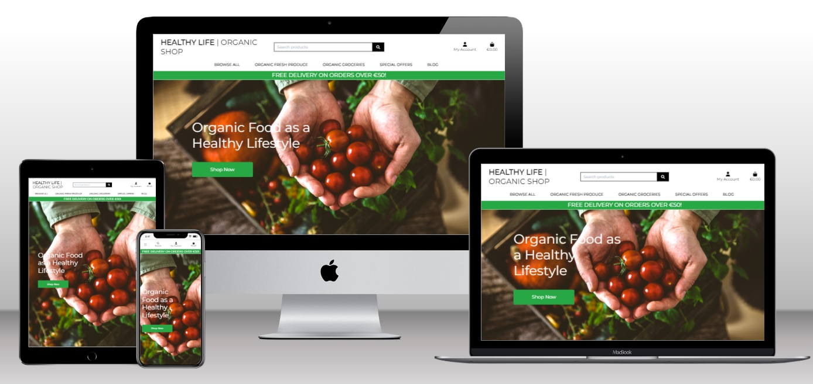

# Table of Content

* [**Project**](<#project>)
    * [Objective](<#objective>)
    * [Site Users Goal](<#site-users-goal>)
    * [Site Owners Goal](<#site-owners-goal>)
    * [Business Model](<#business-model>)
    * [Marketing Strategies](<#marketing-strategies>)
    * [Project Management](<#project-management>)
* [**User Experience (UX)**](<#user-experience-ux>)
    * [Wireframes](<#wireframes>)
    * [User Stories](<#user-stories>)
    * [Site Structure](<#site-structure>)
    * [Design Choices](<#design-choices>)
* [**Features**](<#features>)
    * [Navbar](<#navbar>)
    * [Home Page](<#home-page>)
    * [Products](<#products>)
    * [Product Details](<#product-details>)
    * [Blog](<#blog>)
    * [My Account](<#my-account>)
    * [Django-allauth Features](<#django-allauth-features>)
    * [Add Product](<#add-product>)
    * [Login](<#login>)
    * [Shopping Bag](<#shopping-bag>)
    * [Checkout](<#checkout>)
    * [Order Confirmation](<#order-confirmation>)
    * [Footer](<#footer>)
    * [Toasts](<#toasts>)
* [**Future Features**](<#future-features>)
* [**Technologies Used**](<#technologies-used>)
    * [Languages](<#languages>)
    * [Frameworks & Software](<#frameworks--software>)
* [**Testing**](<#testing>)
    * [Testing User Stories](<#testing-user-stories>)
    * [Code Validation](<#code-validation>)
    * [Additional Testing](<#additional-testing>)
    * [Known Bugs](<#known-bugs>)
* [**Deployment**](<#deployment>)
* [**Credits**](<#credits>)
    * [Content](<#content>)
    * [Media](<#media>)
* [**Acknowledgements**](<#acknowledgements>)

# **Project**

## Objective

Healthy Life Organic Shop is a fictional online ecommerce B2C offering a great range of organic products, including fresh produce and groceries. Our objective is to provide a convenient and reliable platform for individuals seeking a healthier lifestyle. 

## Site Users Goal

The site user's goal is to find and purchase organic products in an easy and convenient way through a secure and user-friendly shopping experience. Site users want to explore and learn about a wide range of organic items, including fresh produce, pantry essentials, personal care products, and more so they can make a purchase that supports a healthier and more sustainable lifestyle. They also expect reliable delivery services.

## Site Owners Goal

The site owner's goal is to provide a positive and user-friendly shopping experience through a robust e-commerce platform with adequate website design, navigation, and checkout process to make it easy and enjoyable for customers to find and purchase organic products.

## Business Model

Healthy Life Organic Shop is a business that only operates online through its ecommerce. We sell fresh produce, groceries and a wide range of products directly to the consumer, so we operate throgh *B2C business model*. We work directly with organic farmers and producers ensuring that our customers have access to a wide range of fresh and sustainable products while supporting local Irish farmers. 

[Back to project](<#project>)

## Marketing Strategies

We have employed a range of marketing strategies to elevate our business presence.
To establish our online presence we use social media platforms like Facebook and Instagram. Furthermore, we build up our audience through a subscription newsletter powered by Mailchimp on our website, expanding our reach and nurturing connections. Additionally, we also have implemented SEO techniques to  target and attract the right clients. Our current marketing strategy presents opportunities for enhancement: marketing content strategy, explore other social media platforms, among others.  

### Mailchimp Newsletter

A newsletter is an important marketing technique to keep in touch with clients. Providing the ethos of the organic shop we want to make it in a mindful way to keep connected to our valued customers. At Healthy Life Organic Shop, we understand the importance of staying connected with our valued customers. We utilize the power of the Mailchimp newsletter to keep the customers informed and engaged. Our newsletter brings the latest updates on new products, exclusive deals, and products on season,  and also keeps the customers informed about our blog posts, providing you with valuable insights and tips for maintaining a healthy lifestyle.

Please, click the link below to see Mailchimp Newsletter:

<b>Mailchimp Newsletter</b>

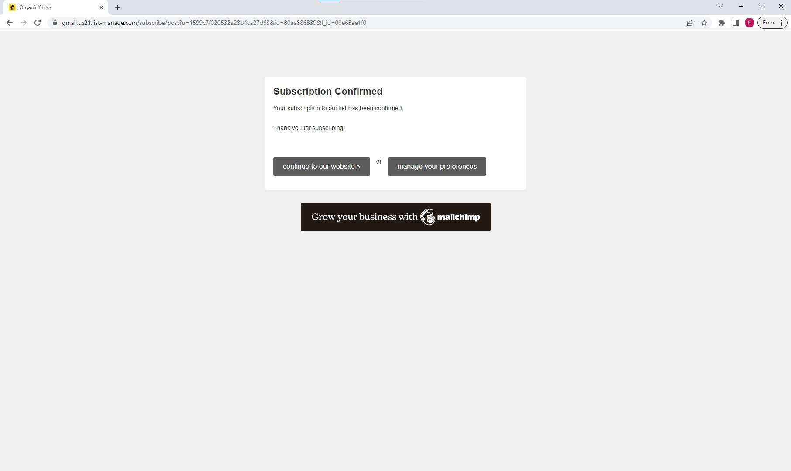
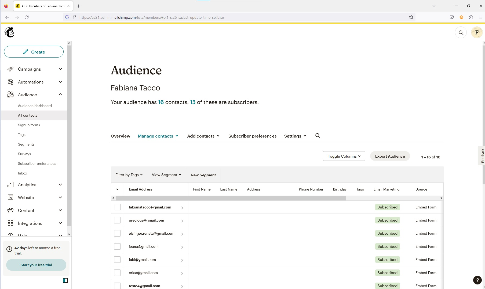

### Facebook Page

To establish a strong online presence for Healthy Life Organic Shop, we have chosen Facebook and Instagram. By utilizing these popular social media platforms, we aim to expand our reach and attract a larger customer base to our ecommerce store. We also intend to foster closer connections with our customers through engaging content and personalized interactions.

The Instagram page is still in progress. Both will be alocated as an asset of Facebook Meta Business Suite, which will allows the management of several aspects such as manage posts and also advertising.  

The navlinks for the social media pages can be acessed from the Footer.

Please, click the link below to see our Facebook page:

<b>Healthy Life Organic Shop Facebook Page</b>

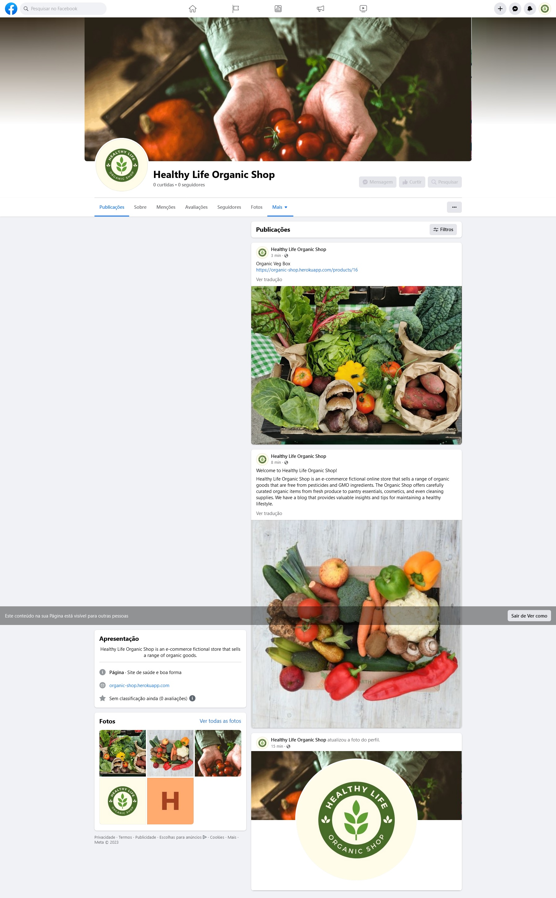

### Search Engine Optimization (SEO)

Search Engine Optimization is extremelly relevant for an organic e-commerce platform as it can attract customers who are genuinely interested in purchasing organic products. The use of SEO tools can enhance the visibility of a website, attract target traffic, improve user experience and increase sales and converting visitors into customers. 

    * Meta Description: Organic shop that sells organic food, organic fruits, vegetablfes, meats, cupboard food.
    * Meta Keywords: organic shop, organic fruit, organic vegetables, organic box, organic veg, fresh fruit, fresh vegetable, 100% organic, organic wholefoods, organic vegetables, Ireland.

Healthy Life Organic Shop also incorporates sitemap.xml and robots.txt files, optimizing the website's crawlability and contributing to a more effective SEO performance.

[Back to project](<#project>)

## Project Management

### GitHub Project

* I have created a kanban project dashboard to manage the project progress. 

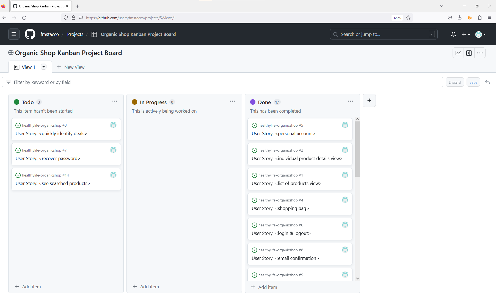

[Back to top](<#table-of-content>)

## User Experience (UX)

### Wireframes

### User Stories

### Epic 1 - Viewing And Navigation
|  | | |
|:-------:|:--------|:--------|
| #1 As a Shopper / User   | I want to be able to view a list of organic products so that I can select some to purchase | &#9745; |
| #2 As a Shopper / User | I want to be able to view individual product details so that I can see the price, description, product rating and product image. | &#9745; |
| #3 As a Shopper / User| I want to be able to quickly identify deals, clearance items and special offers so that I can take advantage of special savings on products I would like to purchase | &#9745; |
| #4 As a Shopper / User | I want to be able to easily view the total of my purchases at any time so that I can avoid spending too much | &#9745; |
| #22 As a Shopper / User |  I want to be able to view blog posts so that I can get the latest information on organic products | &#9745; |
| #23 As a Shopper / User | I want to receive visual feedback while interacting with the content so that I can validate how I have interacted with the page | &#9745; |

### Epic 2 - Registration and User Accounts
|  | | |
|:-------:|:--------|:--------|
| #5 As a Shopper / User | I want to be able to easily register for an account so that I can have a personal account and be able to view my profile| &#9745; |
| #6 As a Shopper / User | I want to be able to easily login and logout so that I can effortlessly access my personal account information.| &#9745; |
| #7 As a Shopper / User | I want to be able to  easily recover my password in case I forget it so that I can recover access to my account| &#9745; |
| #24 As a Shopper / User | I want to log out from the site so that I can ensure the security of my personal information and maintain my privacy. | &#9745; |
| #8 As a Shopper / User | I want to receive an email confirmation after registering so that I can verify that my account registration was successful. | &#9745; |
| #9 As a Shopper / User | I want to have a personalized user profile so that I can view my personal order history and order confirmations, and save my payment information | &#9745; |

### Epic 3 - Sorting and Searching
|  | | |
|:-------:|:--------|:--------|
| #10 As a Shopper / User | I want to  be able to sort the list of available organic products so that I can easily identify the best rated, best-priced and categorically sorted products | &#9745; |
| #11 As a Shopper / User | I want to  be able to sort a specific category of product so that I can find the best-priced or best-rated product in a specific category, or sort the products in that category name  | &#9745; |
| #12 As a Shopper / User | I want to  be able to sort  multiple categories of products simultaneously so that I can find the best-priced or best-rated product accross broad categories, such as "all groceries" or "all fresh produce"  | &#9745; |
| #13 As a Shopper / User | I want to  be able to search for a product by name or description so that I can find a specific product I'd like to purchase  | &#9745; |
| #14 As a Shopper / User | I want to  be able to easily see what I`ve searched for and the number of results so that I can quickly decide whether the product I want is available  | &#9746; |

### Epic 4 - Purchasing and Checkout
|  | | |
|:-------:|:--------|:--------|
| #16 As a Shopper / User | I want to  be able to view items in my bag to be purchased so that I can identify the total cost of my purchase and all organic items I will receive.  | &#9745; |
| #17 As a Shopper / User | I want to  be able to adjust the quantity of individual items in my bag so that I can easily make changes to my purchase before checking out.  | &#9745; |
| #18 As a Shopper / User | I want to  be able to easily enter my payment information so that I can checkout quickly and with no hassles.  | &#9745; |
| #19 As a Shopper / User | I want to  be able to feel my personal and payment information is safe and secure so that I can confidently provide the needed information to make a purchase  | &#9745; |
| #20 As a Shopper / User | I want to  be able to view an order confirmation after checking out so that I can verify that I haven't made any mistakes  | &#9745; |
| #21 As a Shopper / User | I want to  be able to receive an email confirmation after checking out so that I can keep the confirmation on what I've purchased for my records.  | &#9745; |

### Epic 5 - Admin and Store ManagementS
|  | | |
|:-------:|:--------|:--------|
| #25 As a Shopper / User | I want to create a wish list where I can add products I'm interested in, so that I can keep track of items I wish to purchase in the future.  | &#9745; |

### Epic 6 - Wishlist
|  | | |
|:-------:|:--------|:--------|
| #25 As a Shopper / User | I want to create a wish list where I can add products I'm interested in, so that I can keep track of items I wish to purchase in the future.  | &#9745; |
| #26 As a Shopper / User |  I want the ability to remove a product from my wish list, so that I can manage my desired products more effectively.  | &#9745; |
| #29 As a Shopper / User |  I want to be able to easily navigate my Wishlist page so that I can view my favorite organic products.  | &#9745; |
| #27 As a Shopper / User |  I want to share my wish list with friends and family, so that they can easily find gift ideas for special occasions like birthdays or holidays.  | &#9746; |
| #28 As a Shopper / User |  I want to be able to add items directly from the product pages to my wish list, so that I can quickly add products I like without going back to the list.  | &#9746; |

### Site Structure

Healthy Life Orgnic Shop is structured to cater to both registered and non-registered users, aiming to provide a great experience for all. For non-registered and logged-out users, the site offers access to key pages and sections such as *home*, *products*, *categories*, *special offers*, *blog* and also the option to *subscribe to a newsletter* on the footer ensuring they can receive the latest content and keep updated of news and special offers. Once users are registered and logged in, a broader range of features becomes available, such as *profile*, *wishlist*, *logout button*.

### Design Choices

## Technologies Used

### Languages

* [Python](https://www.python.org/)
* [HTML 5](https://en.wikipedia.org/wiki/HTML/)
* [CSS 3](https://en.wikipedia.org/wiki/CSS)
* [JavaScript](https://www.javascript.com/)

### Frameworks, supporting libraries and other programs 

* [Allauth](https://django-allauth.readthedocs.io/en/latest/installation.html) was used for authentication, registration, account management.
* [Amazon Web Services](https://aws.amazon.com/) - A service that hosts all static files and images in the project.
* [Bootstrap](https://getbootstrap.com/) was used to style the website, easily add responsiveness and interactivity.
* [CANVA](https://www.canva.com/) to create the logo, color palete (Pro version) 
* [Crispy Forms](https://django-crispy-forms.readthedocs.io/en/latest/) to style the forms.
* [Django](https://www.djangoproject.com/) as the framework to build the blog.
* [ElephantSQL](https://www.elephantsql.com/) - A PostgreSQL database hosting service.
* [Favicon](https://favicon.io/) - Used to create the favicon.
* [Git](https://git-scm.com/) - Used for version control
* [Gitbash](https://en.wikipedia.org/wiki/Bash_(Unix_shell)) to push changes to the GitHub repository.
* [GitHub](https://github.com/) to host the repositories.
* [Gitpod](https://www.gitpod.io/) as the IDE for the application.
* [Google Chrome DevTools](https://developer.chrome.com/docs/devtools/) - Used to debug and test responsiveness.
* [Gunicorn](https://gunicorn.org/) as the server for Heroku.
* [Heroku](https://www.heroku.com/) to deploy the project.
* [Lighthouse](https://developer.chrome.com/docs/lighthouse/overview/) - Used to test performance of site.
* [PostgreSQL](https://www.postgresql.org/) - Database used for production
* [Psycopg2](https://pypi.org/project/psycopg2/) was used for Python and PostgreSQL databases.
* [PEP8](http://pep8online.com/) for testing and validating the code.
* [Stripe](https://stripe.com/ie) - Used for all the websites payment functionality
* [W3C CSS Validator](https://jigsaw.w3.org/css-validator/) - to validate the CSS.
* [W3C HTML Validator](https://validator.w3.org/) - to validate the HTML.

[Back to top](<#table-of-content>)

## Testing

### Code Validation

Healthy Life Organic Shop ecommerce website has gone through intensive tests throughout its pages and sections/screens.The [W3C CSS Validator](https://jigsaw.w3.org/css-validator/) has been used to validate the CSS, [W3C HTML Validator](https://validator.w3.org/) has been used to validate the HTML, [JSHint](https://jshint.com/) to validate JavaScript and [CI Python Linther](https://pep8ci.herokuapp.com/) to validate Python. Additional tests, such as browser tests, manual testing, responsiveness test, testing user stories among others have been carried on as shown below. 

**HTML validation** 

[W3C HTML Validator](https://validator.w3.org/) has been used to validate the HTML. 

 

**CSS validation** 

[W3C CSS Validator](https://jigsaw.w3.org/css-validator/) has been used to validate the CSS. 

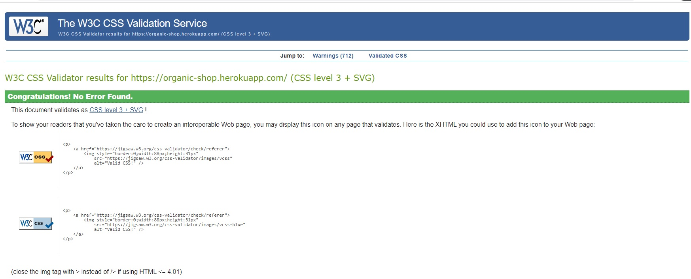 

**JavaScript validation image**

 

**PEP8 CI Python Linther**

CI Python Linther [cipythonlinther](https://pep8ci.herokuapp.com/) was used to validate Python code as at the time of this project submission the validator PEP8 [pep8online](http://pep8online.com/) is offline. I have tested the following Python files:

<b>Bag App - Python Validation</b>

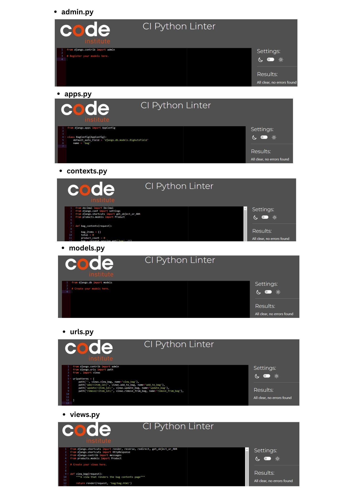

<b>Blog Python Validation</b>

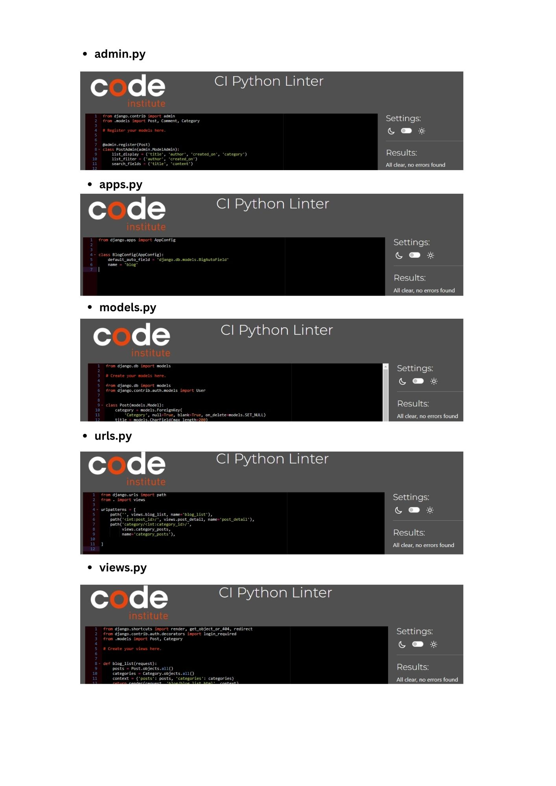

**App Checkout**
*  __init__.py - All clear, no errors found.
* admin.py - All clear, no errors found.
* apps.py - All clear, no errors found.
* forms.py - All clear, no errors found.
* models.py - 5 line-too-long errors reported which I decided to keep it according to code style.
* signals.py - All clear, no errors found.
* urls.py - All clear, no errors found.
* views.py - 5 line-too-long errors reported which I decided to keep it according to code style.
* webhook_handler.py - 3 line-too-long errors reported which I decided to keep it according to code style.
* webhooks.py - All clear, no errors found.

**App Home**
* apps.py - All clear, no errors found.
* urls.py - All clear, no errors found.
* views.py - All clear, no errors found.

**App Products**
* admin.py - All clear, no errors found.
* apps.py - All clear, no errors found.
* forms.py - All clear, no errors found.
* models.py - All clear, no errors found.
* urls.py - All clear, no errors found.
* views.py - 4 line-too-long errors reported which I decided to keep it according to code style.

**App Profiles**
* apps.py - All clear, no errors found.
* forms.py - All clear, no errors found.
* models.py - 5 line-too-long errors reported which I decided to keep it according to code style.
* urls.py - All clear, no errors found.
* views.py - 3 line-too-long errors reported which I decided to keep it according to code style.

**organicshop**
* urls.py - All clear, no errors found.
* views.py - All clear, no errors found.

**other**
* custom_storages.py - All clear, no errors found.

[Back to testing](<#testing>)

### Browser Testing

Healthy Life Organic Shop was manually tested on these browsers as table below and design, layout, functionality and, responsiveness were consistent across all browsers both mobile and desktop.

|   Browser   |    Result  | 
| :---------: | :---------:| 
| Chrome      |   pass     | 
| Edge        |   pass     |
| Firefox     |   pass     |
| Safari      |   pass     |
| IE          |   pass     | 

### Responsiveness Test

Healthy Life Organic Shop ecommerce website was manually tested for its responsiveness with [Google Chrome DevTools](https://developer.chrome.com/docs/devtools/) and [Responsive Design Checker](https://www.responsivedesignchecker.com/).

|        | Nexus 4/5/6 | Galaxy S5/S6/S7 | iPhone 6--12 | iPad |  Display <1200px | Display >1200px |
|--------|-------------|-----------------|--------------|------|------------------|-----------------|
| Render |    pass     |      pass       |     pass     | pass |     pass         |      pass       |
| Images |    pass     |      pass       |     pass     | pass |     pass         |      pass       |
| Links  |    pass     |      pass       |     pass     | pass |     pass         |      pass       |

### Manual Testing

Healthy Life Organic Shop ecommerce website has been extensively tested both on the Gitpod terminal and the Heroku deployed version on the browser. It has been checked features, responsiveness, accessibility, layout, design, texts, buttons and navigation links and form submission on different browsers. 
All tests made aimed to achieve the best user experience in system navigation, so that the user can follow an intuitive and easy flow at all system contact points.

Below are some examples of features tested manually.  

| Test Case              |  Expected Result                                            | Pass/Fail |
|------------------------|-------------------------------------------------------------|-----------|
| Page 404             | Typing in a incorrect URL on the page loads the 404 error page|    pass   |
| Logo                 | Clicking the logo redirects the user to the home page |    pass   |
| Home Page            | All sections and elements are displayed |    pass   |
| Search Bar           | Relevant products matching the search query should be displayed on the search results page. |    pass   |
| My Account menu      | Clicking My account icon displays *Register* and *Login* links|    pass   |
| Register menu item   | Clicking *register* on My account menu redirects to sign up page |    pass   |
| Login menu item      | Clicking *login* on My account menu redirects to login up page |    pass   |
| Browse All dropdown  | Clicking the *browse all* dropdown menu shows by price, by rating, by category, and all products menu items |    pass   |
| Sorting by price     | Clicking the *by price* link in the *browse all* menu lists all products and sorts them by price. |    pass   |
| Sorting by rating     | Clicking the *by rating* link in the *browse all* menu lists all products and sorts them by rating. |    pass   |
| Sorting by category   |Clicking the *by category* link in the *browse all* menu lists all products and sorts them by category.|    pass   |
| All Products         | Clicking the *All Products* link in the *browse all* menu lists all products.|    pass   |
| Organic Fresh Produce dropdown | Clicking the *organic fresh produce* dropdown menu shows fruits, vegetables, bulky buy and all fresh produce menu items. |    pass   | 
| Fruits menu item | Clicking the *fruits* link in the *organic fresh produce* dropdown menu lists all fruits of this category. |    pass   |
| Vegetables menu item | Clicking the *vegetables* link in the *organic fresh produce* dropdown menu lists all vegetables of this category. |    pass   |
| Bulky buy menu item | Clicking the *bulky but* link in the *organic fresh produce* dropdown menu lists all bulky buy products of this category. |    pass   |
| All fresh produce | Clicking the *all fresh produce* link in the *organic fresh produce* dropdown menu lists all all fresh produce products |    pass   |

|                    |                      |       |     |

| Play Ideas Button      | Verify if the play ideas button loads the play ideas list            | Clicking the play ideas button displays the play ideas list | pass      |
| Play Ideas Page        | Check if the play ideas are listed correctly                         | Play ideas are displayed in a grid layout                  | pass      |
| Post Detail Page       | Ensure the post detail page shows correct content                    | Post content, comments, and likes are shown                 | pass      |
| User Registration      | Test the user registration process                                   | User can successfully register                              | pass      |
| User Login             | Test the user login process                                          | User can successfully log in                                 | pass      |
| Add Post               | Test the functionality to add a new play idea for logged users       | New play idea is added to the blog                          | pass      |
| Update Post            | Test updating an existing play idea                                  | Play idea is updated successfully                           | pass      |
| Delete Post            | Test deleting a play idea                                            | Play idea is deleted from the blog                          | pass      |
| Nav Links Footer       | Check if the navigation links in the footer are working              | Clicking on a footer nav link redirects to the page         | pass      |
| Social Links           | Test if social links in the footer open in a new window              | Clicking on a social link opens a new window                | pass      |
| Subscribe Newsletter   | Test the subscribe newsletter feature                                | User can submit their email and is redirected to a thank you page | pass |
| Profile Page           | Check if the profile page is loading correctly                       | User can view their profile page                            | pass      |
| Update Profile         | Check if users can update their profile with a bio and picture       | Users can upload a profile picture and add a bio            | pass      |
| Clear Profile          | Check if users can clear their bio and picture from their profile    | Users can remove their profile picture and bio              | pass      |
| User's Posts - Profile | Check if users can see and access their own added play ideas         | Users can view and access their own play ideas              | pass      |
| Feedback Messages      | Check if feedback messages are displayed in relevant submissions     | Users receive appropriate feedback messages                 | pass      |

### Testing User Stories

### Epic 1 - Viewing And Navigation

* As a Shopper/User I want to be able to **view a list of organic products** so that I can select some to purchase. (#1) 
   
    * At the top of the website, there is a navigation bar where the shopper/user can select to see *all products*, *organic fresh produce*, *organic groceries* and *special offers*. 

* As a Shopper/User I want to be able to **view individual product details** so that I can see the price, description, product rating, and product image. (#2)

    * When on the products page, the Shopper / User can click on the individual product to see the product details such as description, product rating, price, image, and others.

* As a Shopper/User I want to be able to **quickly identify deals, clearance items and special offers** so that I can take advantage of special savings on products I would like to purchase. (#3)

    * At the top of the website, there is a navigation button called *special offers* where Shopper/User can quickly identify deals, and special offers.

* As a Shopper/User I want to be able to easily **view the total of my purchases** at any time so that I can avoid spending too much. (#4)

    * At the right corner of the screen the Shopper / User can see the total amount of the current organic products that are on the bag and also a bag icon. The user can also click the bag icon to see the shopping bag.

* As a Shopper/User I want to be able to **view blog posts** so that I can get the latest information on organic products. (#22)

    * At the top of the website, there is a navigation button called *blog* where the Shopper/User can click and choose to see the following categories: *health advice*, *weight loss*, *recipes* or *all posts*.

* As a Shopper/User I want to **receive visual feedback** while interacting with the content so that I can validate how I have interacted with the page.(#23)

    * When a Shopper / Site User interacts with the content, (i.e. deleting, updating, login, logout etc..) they receive visual feedback through flash messages saying, for example: "Removed Organic Blueberries from your bag". 

### Epic 2 - Registration and User Accounts

* As a Shopper/User I want to be able to **easily register for an account** so that I can have a personal account and be able to view my profile. (#5)

    * By clicking the My Account icon the user can then click the Register link and sign up for a new account.

* As a Shopper/User I want to be able to **easily login** so that I can effortlessly access my personal account information. (#6)

    * By clicking the My Account icon the user can then click the Login link and login into their account. 

* As a Shopper/User I want to **receive an email confirmation after registering** so that I can verify that my account registration was successful. (#8)

    * After the signup process the user will receive an email confirmation and will be asked to confirm their email address. Then they will receive a flash message confirming that successfully registered.   

* As a Shopper/User I want to be able to **easily recover my password** in case I forget it so that I can recover access to my account. (#7)

    * On the login page the user has the option to click the link "Forgot Password?" and they can easily recover it by receiving a Password Reset E-mail with the instructions.. 

* As a Shopper/User I want to **log out from the site** so that I can ensure the security of my personal information and maintain my privacy.(#24)

    * When the user is logged in they have the option to 'Log Out' through the navigation menu.

* As a Shopper/User I want to **have a personalized user profile** so that I can view my personal order history and order confirmations, and save my payment information. (#9)

    * While logged in the Shopper / User has the access to their personalized user profile where they can update their information and see order history.

### Epic 3 - Sorting and Searching

* As a Shopper/User I want to  be able to **sort the list of available organic products** so that I can easily identify the best rated, best priced and categorically sorted products.(#10)

    * At the top of the website, there is a navigation button called **browse all** where the shopper / user can sort to browse products by **price**, **rating** and **category**, once there they can select to see price and rating(low to high or high to low) and **name and category** (A-Z or Z-A).

* As a Shopper/User I want to  be able to **sort a specific category of product** so that I can find the best-priced or best-rated product in a specific category, or sort the products in that category name.(#11)

    * At the top of the website, there are navigation buttons called **organic fresh produce**, **organic groceries** where the shopper / user can sort a specific category such as *fruits*, *vegetables*, *pasta and rice*, among others. 

* As a Shopper/User I want to  be able to sort **multiple categories of products** simultaneously so that I can find the best-priced or best-rated product across broad categories, such as "all groceries" or "all fresh produce".(#12)

    * At the top of the website, the user can access the links for **all fresh produce** and **all groceries**  where multiple categories are shown.

* As a Shopper/User I want to  be able to **search for a product by name or description** so that I can find a specific product I'd like to purchase.(#13 )

    * At the top of the site there is a navigation search bar that search products by name or description.

* As a Shopper/User I want to  be able to **easily see what I`ve searched for and the number of results** so that I can quickly decide whether the product I want is available.(#14)

    * This feature has not been implemented.

### Epic 4 - Purchasing and Checkout

* As a Shopper/User I want to  be able to **view items in my bag to be purchased** so that I can identify the total cost of my purchase and all organic items I will receive. (#16)

    * The Shopper/User can easily view the shopping bag by clicking the bag icon in the top right corner navigation bar.

*  As a Shopper/User I want to  be able to **adjust the quantity of individual items** in my bag so that I can easily make changes to my purchase before checking out. (#17)

    * The Shopper/User can easily view the shopping bag by clicking the bag icon in the top right corner navigation bar.

* As a Shopper/User I want to  be able to **easily enter my payment information** so that I can checkout quickly and with no hassles. (#18)

    * The user can easily and confidently enter the payment information needed in the secure checkout page.

* As a Shopper/User I want to  be able to **feel my personal and payment information is safe and secure** so that I can confidently provide the needed information to make a purchase. (#19)

    * The website prioritizes the security and safety of our customers' personal and payment information fostering a sense of trust and confidence in our users.

* As a Shopper/User I want to  be able to **view an order confirmation after checking out** so that I can verify that I haven't made any mistakes. (#20)

    *  After completing the order the shopper/user can view an order confirmation page with the order number which is also on their profile.

* As a Shopper/User I want to  be able to **receive an email confirmation after checking out** so that I can keep the confirmation on what I've purchased for my records. (#21)

    *  After completing the order the shopper/user receives a confirmation e-mail to the e-mail that has been registered in the checkout process.

### Epic 5 - Admin and Store Management

### Epic 6 - Wishlist

* As a Shopper/User I want to **create a wish list** where I can add products I'm interested in, so that I can keep track of items I wish to purchase in the future. (#25)

    * The shopper/user can create a wish list by clicking on the button "Add to Wishlist" on the product detail page.  

* As a Shopper/User I want the ability to **remove a product from my wish list**, so that I can manage my desired products more effectively. (#26)

    * The shopper/user can remove a product from their wish list page by clicking on the button "Remove from my Wishlist" on the Wishlist page.

* As a Shopper/User I want to be able to **easily navigate my Wishlist page** so that I can view my favorite organic products. (#29)

    * The shopper/user can easily navigate their Wishlist page by clicking on *Wishlist link* My Account Menu.

 * As a Shopper/User I want to **share my wish list with friends and family**, so that they can easily find gift ideas for special occasions like birthdays or holidays.(#27)

    * This feature has not been implemented.

* As a Shopper/User I want to be able to **add items directly from the product pages** to my wish list, so that I can quickly add products I like without going back to the list. (#28)

    * This feature has not been implemented.

[Back to top](<#contents>)

### Bugs Fixed

Along the development of Its4kids application some error appeared during the debug process which were corrected, for example programming errors due to not running migrations, path errors, among others. Also during the website testing process some smaller errors appeared on the code validation and they were immediately corrected. 

Follow below some examples:

 

 

 

 

### Additional Testing

### Acessibility 

The website color accessibility was checked by using [A11y](https://color.a11y.com/).

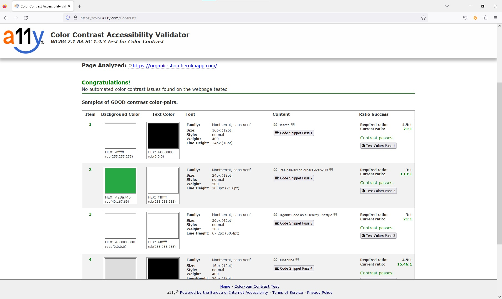 

### Lighthouse

A test was conducted using [Google Lighthouse](https://developers.google.com/web/tools/lighthouse) within Chrome Developer Tools. 

It tests each of the pages for ***performance, accessibility, best practices and, SEO***

The performance score of 73% can be significantly enhanced by simply resizing all the images used on the website.

[Back to top](<#contents>)

## Deployment

The deployment process was completed by using [GitHub](https://github.com/), [ElephantSQL](elephantsql.com), [Heroku](heroku.com), following the steps below: 

1. A new repository called healthylife-organicshop was created on [GitHub](https://github.com/) using the [Code Institute full template](https://github.com/Code-Institute-Org/gitpod-full-template).
2. A new workspace was created in Gitpod by clicking to the green ‘Gitpod’ button.
3. **Django and supporting librari were installed as below:

    *In the terminal*:
    **Install django and gunicorn:** pip3 install 'django<4' gunicorn
    **Install supporting libraries:** pip3 install dj_database_url==0.5.0 psycopg2
    **Create requirements file:** pip3 freeze --local > requirements.txt
    **Create project:** django-admin startproject organicshop .
    **Create app:** python3 manage.py startapp home

    *In settings.py*
    **Add app to installed apps:** 
    INSTALLED_APPS = [
    …
    'home',
    ]

    *In the terminal*:
    **Migrate changes:** python3 manage.py migrate
    **Run Server to Test:** python3 manage.py runserver
    **Get the hostname:** '8000-fmstacco-healthylifeorg-w9zqseip2fh.ws-eu101.gitpod.io'

    *In settings.py*
    **Add the hostname to Allowed Hosts:** ALLOWED_HOSTS = ['8000-fmstacco-healthylifeorg-w9zqseip2fh.ws-eu101.gitpod.io']

4. An external database was created on [ElephantSQL](elephantsql.com) 
5. An app was created deployed to [Heroku](heroku.com).

### **Forking this repository on GitHub**

A fork of this repository can be made which will allow you to make changes to this project without affecting the original repository. 

The steps below should be followed to ***fork*** the respository:

1. Log in to ***GitHub*** and find the [repository](https://github.com/fmstacco/healthylife-organicshop).

2. Click on the button ***fork*** on the right-hand side of the page to create a copy of the original repository in your GitHub account.

See the image below:

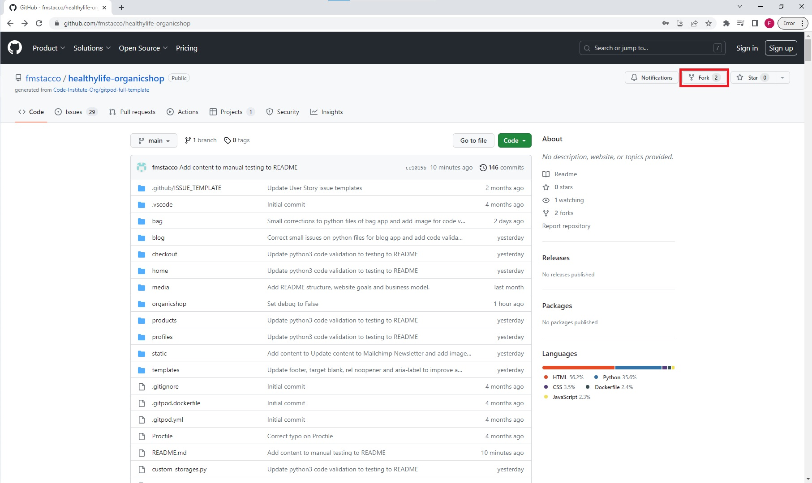

[Back to top](<#contents>)

### **Cloning this project on GitHub**

The steps below should be followed to ***clone*** the respository:

1. On the repository’s page, click on the ***code*** tab.
2. On the ***Clone with HTTPS*** tab, click on the icon (see image below) to copy the URL.

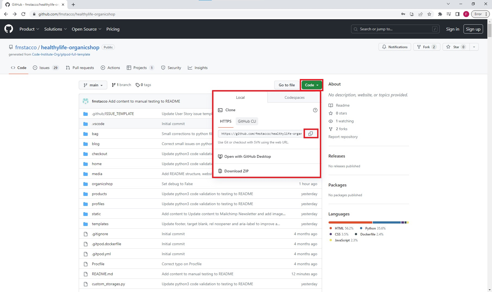

3. Open ***Git Bash*** on your IDE terminal.
4. Change the current working directory to the location where you want the cloned directory.
5. Type ***git clone***, and then paste the URL copied from GitHub.

Type: git clone + https://github.com/fmstacco/healthylife-organicshop.git

6. Press ***enter*** and the local clone will be created.

Help on cloning a repository from GitHub can be found [here](https://docs.github.com/en/repositories/creating-and-managing-repositories/cloning-a-repository).

[Back to top](<#contents>)

## Credits

### Code
[Boutique Ado](https://github.com/Code-Institute-Solutions/boutique_ado_v1) - This project is so far fully based on Boutique Ado walkthrough which will be customized in the next submission.
[Stackoverflow](https://stackoverflow.com/) - helped me along the way with some bugs. 
[Ricardo Maroquio](https://www.youtube.com/watch?v=3dobl8hdeYw) - inspirations for the code for ecommerce organic shop.
[Denis Ivy](https://www.youtube.com/watch?v=_ELCMngbM0E&list=PL-51WBLyFTg0omnamUjL1TCVov7yDTRng) - tutorial on Django Ecommerce Website 

### Content 
[Green Earth Organics](https://www.greenearthorganics.ie/) - the description of the products was taken from this ecommerce Green Earth Organics, which was also an inpiration for this project.
[Evergreen](https://evergreen.ie/blogs) - I got the content for the blog posts.

### Media
* [Canva](https://canva.com/) - I got the image for hero home page under the Pro subscription. 
* [The Organic Shop](https://theorganicshop.ie/) - I got all the images for the products from The Organic Shop, which was also an inspiration for this project.

# Acknowledgements

Healthy Life Organic shop was designed and developed for Portfolio 5 project, a requirement of Full Stack Software Developer Diploma Course (Eccommerce) at the [Code Institute](https://codeinstitute.net/). First of all I would like express my gratitude to Bethany from the Student Care, without her huge support, encouragement and understanding I would not be able to complete this project. I also would like to thank my mentor [Precious Ijege](https://www.linkedin.com/in/precious-ijege-908a00168/), my Cohort facilitators, my Cohort colleagues, the Slack community and the Tutor Assistance for all guidance and support during this journey. I am also thankful to the ***Mayo, Sligo and Leitrim Education Training Board (msletb)*** for this opportunity. I  would also like to say thank you to my family, my husband Michel and, my children, Alanna, and Peter who is just 17 months old at the time of this project submission. 

[Back to top](<#table-of-content>)

Fabiana Tacco (2023)